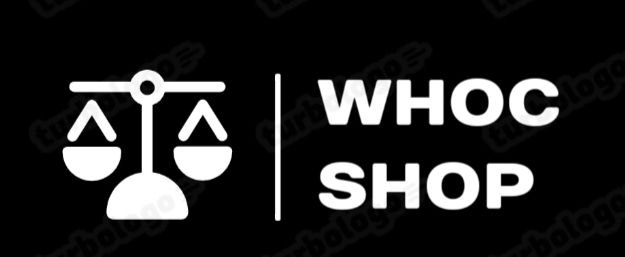

<h1 align="center">WHOC Shop</h1>
<h3 align="center">made by <a href="https://github.com/VA-CYBER-DOC" target="_blank">VA</a>  and <a href="https://github.com/NeMoSemi" target="_blank">Nemo_Semi</a></h3>
<a>
<h2>Сайт</h2>

Представляет вашему внимания сайт WHOC Shop для покупки и продажи музыкальных инструментов

На главной странице сайта вы можете наблюдать каталог товаров, которых можно увеличивать через телеграм бота, доспуп к которому есть у администратора

На сайте присутствует авторизация и профиль пользователя, а покупка товара осуществляется через телеграм бота

<h2>Телеграм бот</h2>

Функционал бота отличается в зависимости от того, кем является пользователь. В первом случае пользователь является покупателем, тогда он может только завершать покупку через сайт. Если пользователь является администратором то он может: добавить товар, удалить товар, заблокировать пользователя, и разблокировать пользователя. Профиль же суперадмина отличается только возможностью добавлять админов.

</a>